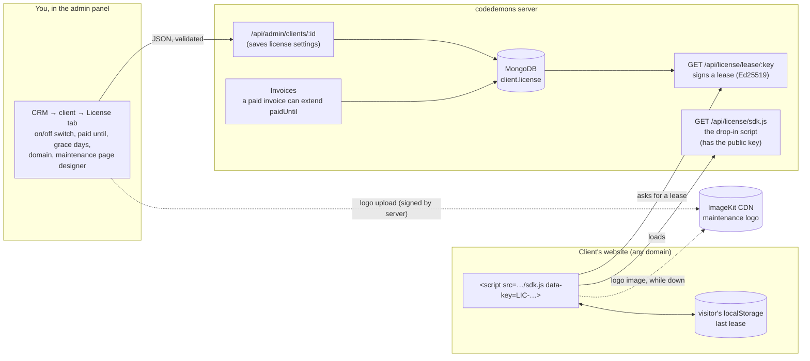
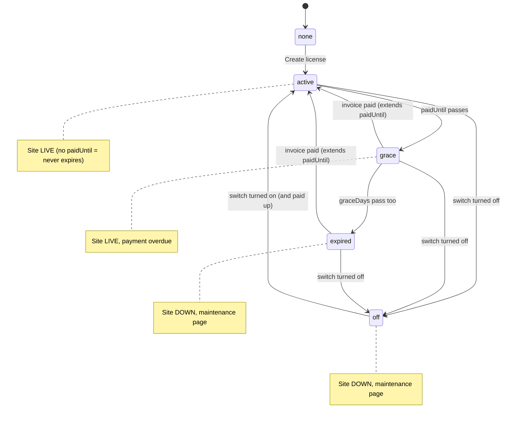
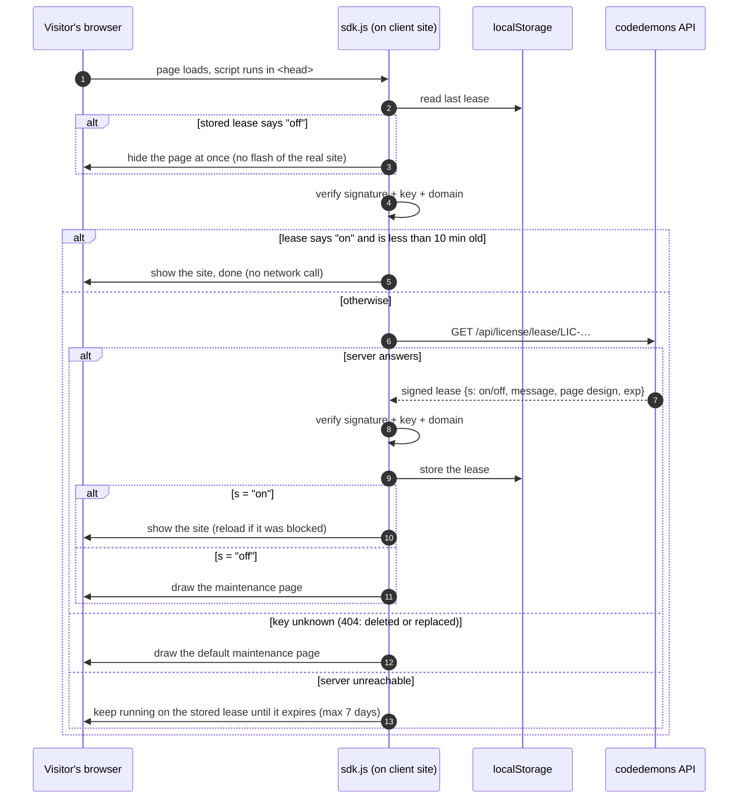
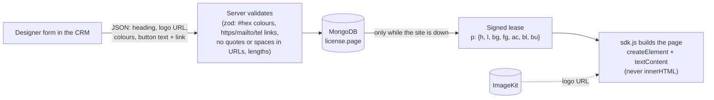

# codedemons

Studio website, admin panel (content + CRM) and client portal.

| Folder | What | Docs |
|---|---|---|
| `client/` | React app: public site, `/admin`, `/portal` | [client/README.md](client/README.md) |
| `server/` | Express + MongoDB API | [server/README.md](server/README.md) |

- **Media** (project images, videos, review videos, maintenance-page logos) is stored on **ImageKit only**. The browser uploads straight to ImageKit; the server only signs the upload. Uploads stop with a clear error until `IMAGEKIT_PUBLIC_KEY`, `IMAGEKIT_PRIVATE_KEY` and `IMAGEKIT_URL_ENDPOINT` are set in `server/.env`. Nothing is written to the server's disk, so redeploys never lose files.
- The **license system** below lets you switch a client's website off from the CRM, or let it go into maintenance automatically when they stop paying.

---

## License system

Every client website you build can carry one line of script. Through it, the CRM decides whether that site is **live** or shows a **maintenance page**, which you design per client.

### The pieces



1. **Key:** "Create license" gives the client a random key (`LIC-…`). You paste the snippet from the License tab into their site's `<head>`:
   ```html
   <script src="https://codedemons.in/api/license/sdk.js" data-key="LIC-XXXXXXXXXXXX"></script>
   ```
2. **Settings** live on the client record in MongoDB (`client.license`): `on` (the manual switch), `paidUntil`, `graceDays`, `domain`, `message`, and `page` (the maintenance page design).
3. **Server cache:** the lease endpoint keeps each license's settings in memory for up to 3 days, so most requests skip MongoDB. The entry is dropped the moment that client is saved or deleted (Mongoose hooks), so the switch, a new key and paid invoices still apply immediately. The status itself is worked out with the current time on every request, so due dates take effect on time. The cache is per process: if the API ever runs as several instances, share it via Redis or remove it (`server/src/shared/utils/licenseCache.util.ts`).
4. **Lease:** the script asks the server for a lease, a small JSON payload signed with an Ed25519 private key. The private key is derived from `LICENSE_SECRET` and never leaves the server; the public key is baked into `sdk.js`, so the script can check that a lease really came from us.

### Installing it on a client's project (pick the strongest that fits)

| | How | Visitor can bypass by… | Client can remove it? |
|---|---|---|---|
| **1. Server guard** (fullstack: Node, Next.js, edge) | `license-guard.mjs` runs on their server before their app | nothing: the real pages and API are never sent while off | yes, by editing their server code |
| **2. Script, first-party** (any site) | `sdk.js` served from the client's own domain via a rewrite | turning off JS or a hand-written block rule for that site | yes |
| **3. Script, plain** (any site) | `<script src="https://codedemons.in/api/license/sdk.js">` | strict blockers (NoScript, uBlock hard mode, Brave aggressive), a custom rule, disabling JS | yes |

No version can stop the client from deleting it from code they control. Only hosting their site yourself does that, and the signed **Maintenance & License Agreement** (CRM document template) is the real backstop. Both scripts and the guard **fail open** when codedemons is unreachable, so an outage on our side never takes a client down.

**1. Fullstack app (Node, Next.js or edge backend): use the server guard.** The CRM License tab shows this ready to copy:

```bash
curl -o license-guard.mjs https://codedemons.in/api/license/guard.mjs      # once; commit the file
curl -o license-guard.d.mts https://codedemons.in/api/license/guard.d.mts  # TypeScript projects: types, next to it
```
```js
// server entry, before every other route and static files
import { licenseGuard } from "./license-guard.mjs"
app.use(licenseGuard({ key: process.env.CODEDEMONS_LICENSE }))
```
```bash
# .env
CODEDEMONS_LICENSE=LIC-XXXXXXXXXXXX
```

- Works with Express, Connect, NestJS (`app.use`) and plain `http`.
- **Next.js and edge runtimes** use the same file. It relies only on web-standard APIs (`crypto.subtle`, `fetch`, `Response`). `guard.respond(request)` returns a ready 503 `Response` while off, or `null`:
  ```ts
  // middleware.ts (Next.js); runs before every page, API route and static file
  import { NextResponse, type NextRequest } from "next/server"
  import { licenseGuard } from "./license-guard.mjs"

  const guard = licenseGuard({ key: process.env.CODEDEMONS_LICENSE! })

  export async function middleware(request: NextRequest) {
    return (await guard.respond(request)) ?? NextResponse.next()
  }
  ```
  The same `respond(request)` call works in Cloudflare Workers, Hono, Bun and Deno. Tested on Node and inside workerd (Cloudflare's runtime). If a runtime lacks Ed25519, the guard logs an error and fails open, rather than silently never blocking.
- Anything else: `guard.check()` returns `{ off, html, message }`.
- While off: browsers get the designed maintenance page (status 503, every value escaped), and API calls get `503 { success: false, message }`. The real app never runs.
- Re-checks every 10 minutes while live (`refreshMs` option) and every 30 seconds while down, in the background, so requests never wait. Only the very first request after boot waits, at most 5 seconds.
- Verifies every lease with the codedemons public key, so a fake server can't switch the app on or off. Keeps the last verified lease if we're unreachable (up to 7 days), and backs off for 30 seconds after a failed fetch.
- For a React/Vite frontend served by the same Node server, the guard covers it too, as long as `app.use(licenseGuard(…))` comes before the static files. Add the script tag as well only if the frontend is hosted separately.

**2. Any site: serve the script from the client's own domain.** Forward one path to us, then point the tag at it:

```js
// vercel.json
{ "rewrites": [{ "source": "/cd-license/:path*", "destination": "https://codedemons.in/api/license/:path*" }] }
```
```toml
# netlify.toml
[[redirects]]
  from = "/cd-license/*"
  to = "https://codedemons.in/api/license/:splat"
  status = 200
```
```nginx
# nginx
location /cd-license/ { proxy_pass https://codedemons.in/api/license/; proxy_ssl_server_name on; }
```
```html
<script src="/cd-license/sdk.js" data-key="LIC-XXXXXXXXXXXX"></script>
```
The script fetches its lease relative to its own URL (`/cd-license/lease/…`), so nothing else changes. To blockers it's just the site's own code.

**3. Any site, quickest:** the plain `<script>` tag shown in the CRM License tab.

### Is the site live? (license states)



| State | When | Site |
|---|---|---|
| `none` | no license yet | script does nothing useful (no key) |
| `active` | switch on, and `paidUntil` empty or in the future | live |
| `grace` | switch on, `paidUntil` passed, still within `graceDays` | live, CRM and portal warn "payment overdue" |
| `expired` | switch on, `paidUntil` + `graceDays` passed | **down** |
| `off` | you turned the switch off | **down** |

An invoice created with "When paid, extend their license by…" moves `paidUntil` forward when it's paid (from today, or from the current `paidUntil` if that's later). That's how a maintenance plan keeps the site alive automatically.

### What happens when someone opens the client's site



Timing that follows from this:

- **Switching off** reaches new visitors immediately. Visitors whose browser holds a fresh "on" lease see it within **10 minutes**.
- **Switching back on** shows on the next page load (an "off" lease is re-checked on every load), and an open blocked tab reloads itself.
- **Your server down** never takes client sites down: they keep their stored lease for up to **7 days**. An "on" lease never runs past the end of the grace period.
- **Replace key** makes the old key answer 404, so sites with the old snippet go to the maintenance page until you update their snippet.

### The maintenance page

Designed per client in **CRM → client → License → "Maintenance page visitors see while it's down"**, with a live preview: logo, heading, message, background/text/button colours, and an optional button (`https://`, `mailto:` or `tel:` link).



- **No HTML is ever sent.** The lease carries plain values, and the script builds the page itself with `textContent`, so text that looks like HTML or script is shown as text, never run.
- The script **re-checks** colours (`#rrggbb`) and links (`https:`, `mailto:`, `tel:`) before using them, even though the lease is signed.
- The logo is an **ImageKit URL**; visitors' browsers load it straight from the CDN.
- The design only travels in "off" leases, so live sites download nothing extra.

### Security notes

- Leases are **signed**: a visitor can't fake "on" by editing localStorage, and the server can't be impersonated.
- **Domain lock:** set "Domain" in the License tab and the lease only works on that domain and its subdomains (plus `localhost` for development).
- On `http://` pages or browsers without Ed25519, the script can't check signatures, so it only trusts leases fetched fresh from the server, never stored ones.
- **Set `LICENSE_SECRET` once and never change it.** It defines the key pair (if empty, it's derived from `ACCESS_TOKEN_SECRET`, so changing that has the same effect). A new key pair invalidates every stored lease, and browsers still holding the old cached `sdk.js` (up to an hour) reject the new leases.
- **This is a soft lock.** It runs in the visitor's browser, so a client with access to their own code can delete the script tag. Use it as leverage for maintenance plans, not as hard protection.

### Where the code lives

| What | File |
|---|---|
| Lease signing, states, invoice → license extension | `server/src/shared/utils/crm.util.ts` |
| Lease endpoint + the `sdk.js` script | `server/src/modules/public/license/license.router.ts` |
| Server guard for fullstack apps (served at `/api/license/guard.mjs`) | `server/src/modules/public/license/license.guard.ts` |
| End-to-end check of guard + first-party script | `.claude/skills/run-codedemons/guard-check.mjs` (run `node driver.mjs up`, then `node guard-check.mjs`) |
| Server-side license cache | `server/src/shared/utils/licenseCache.util.ts` (cleared by hooks in `client.model.ts`) |
| License settings validation (incl. page design) | `server/src/modules/admin/crm.router.ts` |
| Data model (`client.license`) | `server/src/shared/models/client.model.ts` |
| CRM License tab, designer, preview | `client/src/features/crm/ui/tabs/LicenseTab.tsx`, `client/src/features/crm/ui/license/*`, `client/src/features/crm/hooks/useLicenseTab.ts` |
