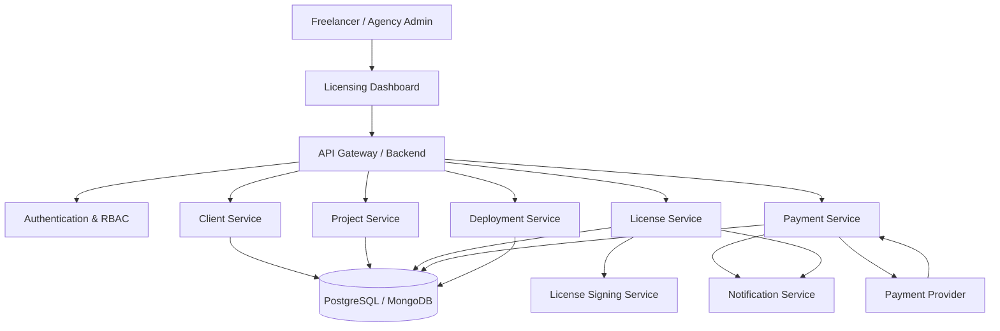
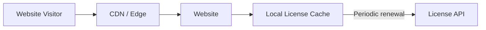
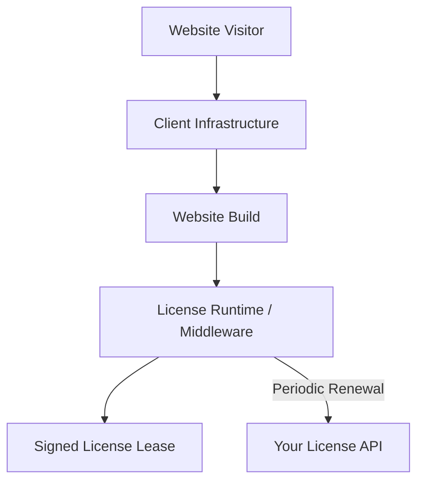
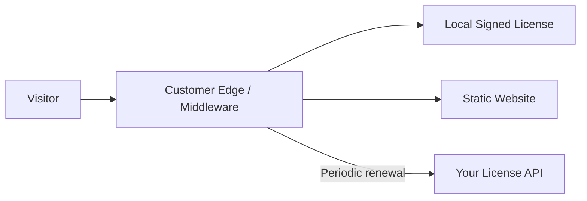
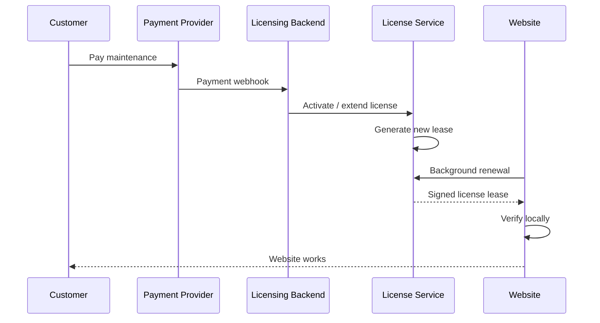
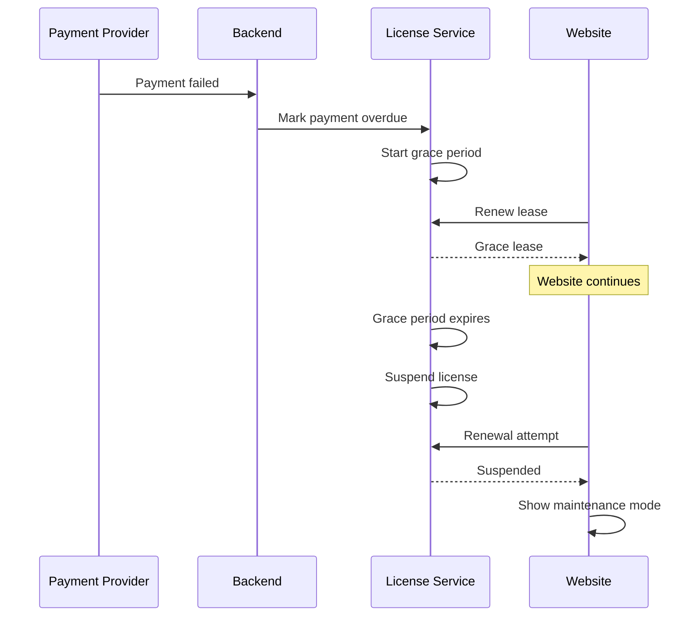
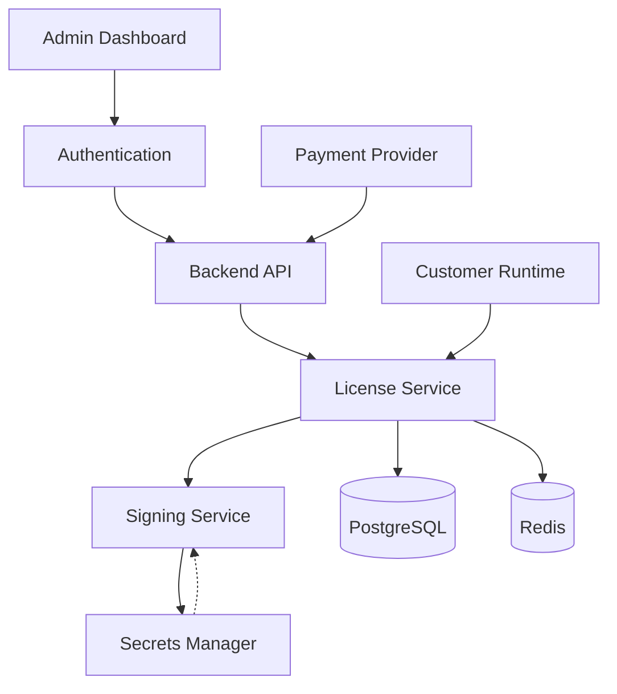
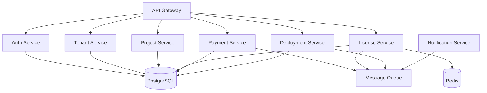
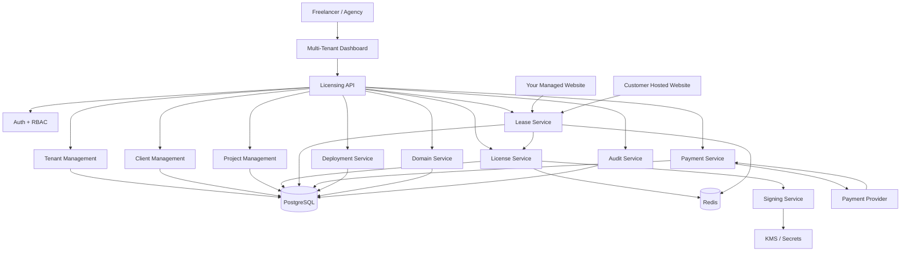

# Multi-Tenant Website Licensing & Maintenance Platform

A multi-tenant SaaS platform for managing websites delivered to freelance clients under a **license + maintenance subscription model**.

The platform allows a freelancer/agency to:

- Create clients and projects
- Generate licenses
- Manage domains
- Manage maintenance subscriptions
- Deploy websites on their own infrastructure
- Provide deployment builds to clients who want to host on their own infrastructure
- Suspend websites when maintenance/license payments expire
- Show a controlled maintenance page when a license is suspended
- Manage multiple websites from one dashboard
- Verify licenses without making a request to the licensing server on every page load
- Support both backend-based and frontend-only websites
- Maintain a grace period when the licensing server is temporarily unavailable

---

# 1. Core Idea

The platform consists of two major systems:

```text
┌─────────────────────────────────────────────────────────────┐
│                    YOUR LICENSING PLATFORM                  │
│                                                             │
│  Dashboard → Clients → Projects → Licenses → Payments      │
│                         │                                   │
│                         ▼                                   │
│                   License Service                           │
│                         │                                   │
│                         ▼                                   │
│                License Database                             │
└─────────────────────────┬───────────────────────────────────┘
                          │
                    License Lease
                          │
              ┌───────────┴───────────┐
              │                       │
              ▼                       ▼
       Your Infrastructure      Client Infrastructure
              │                       │
              ▼                       ▼
         Website App             Website Build
```

The website should **not** ask:

```text
"Is my license valid?"
```

for every visitor.

Instead, your licensing system issues a **signed license lease**.

The website verifies that lease locally.

---

# 2. Why Not Check Your Server On Every Request?

A naive implementation would look like:

```text
Visitor
   ↓
Website
   ↓
Your License API
   ↓
MongoDB
   ↓
Response
   ↓
Website
```

This is a bad architecture.

If the visitor opens:

```text
example.com
```

you don't want:

```text
Browser
   ↓
Client Server
   ↓
Your Server
   ↓
Client Server
   ↓
Browser
```

for every request.

Problems:

- Added latency
- Your license server becomes a dependency
- Your server receives huge amounts of traffic
- If your server goes down, every client website can break
- More bandwidth
- More infrastructure cost
- Bad user experience
- DDoS/amplification concerns

Instead, use **local verification**.

---

# 3. The License Lease Model

The central concept of this system is a **license lease**.

Suppose a client has:

```text
License:
LIC_8F92A1

Domain:
example.com

Status:
ACTIVE
```

Your licensing server creates a signed authorization.

Conceptually:

```json
{
  "licenseId": "LIC_8F92A1",
  "projectId": "PROJECT_123",
  "domain": "example.com",
  "status": "active",
  "issuedAt": "2026-10-05T00:00:00Z",
  "validUntil": "2026-10-12T00:00:00Z",
  "version": 1
}
```

This data is then cryptographically signed by your server.

The customer's website receives something like:

```text
SIGNED_LICENSE_LEASE
```

The website contains your **public verification key**.

It can then verify:

```text
Is this lease genuine?
        │
        ├── YES
        │
        ▼
Is it still valid?
        │
        ├── YES → Website works
        │
        └── NO → Maintenance mode
```

No network request is required for this verification.

---

# 4. Public Key / Private Key Architecture

Use asymmetric cryptography.

For example:

```text
                  YOUR SERVER

              Private Key
                   │
                   ▼
             Sign License
                   │
                   ▼
            Signed License
                   │
                   │
                   ▼
        ┌─────────────────────┐
        │ Customer Deployment │
        │                     │
        │ Public Key          │
        │       │             │
        │       ▼             │
        │ Verify Signature    │
        └─────────────────────┘
```

The important rule:

> **Never put the private signing key inside a customer deployment.**

The customer deployment only gets the public key.

Even if someone extracts the public key, they cannot generate a valid new license with it.

---

# 5. License Lifecycle

A license should have explicit states.

```text
                    ┌─────────────┐
                    │   CREATED   │
                    └──────┬──────┘
                           │
                           ▼
                    ┌─────────────┐
                    │    ACTIVE   │
                    └──────┬──────┘
                           │
                     Payment Due
                           │
                           ▼
                    ┌─────────────┐
                    │   GRACE     │
                    └──────┬──────┘
                           │
                    Grace Expired
                           │
                           ▼
                    ┌─────────────┐
                    │  SUSPENDED  │
                    └──────┬──────┘
                           │
                      Payment Made
                           │
                           ▼
                    ┌─────────────┐
                    │    ACTIVE   │
                    └─────────────┘
```

There should also be:

```text
REVOKED
```

for situations where the license should never become active again without manual intervention.

---

# 6. Recommended Grace Period

Do not suspend immediately after a payment failure.

Example:

```text
Maintenance payment
       │
       ▼
Payment succeeds
       │
       ▼
License ACTIVE
       │
       │
       ▼
Payment becomes overdue
       │
       ▼
7-day GRACE PERIOD
       │
       ├── Payment received
       │        ↓
       │      ACTIVE
       │
       └── No payment
                ↓
             SUSPENDED
                ↓
         Maintenance Page
```

The grace period should be configurable per plan.

For example:

```text
Starter      → 3 days
Business     → 7 days
Enterprise   → 15 days
```

---

# 7. Multi-Tenant Architecture

The platform itself should be multi-tenant.

The basic hierarchy:

```text
Platform
│
├── Tenant / Agency
│
│   ├── Users
│   │
│   ├── Clients
│   │   │
│   │   ├── Client A
│   │   │     │
│   │   │     ├── Project 1
│   │   │     ├── Project 2
│   │   │     └── Project 3
│   │   │
│   │   └── Client B
│   │
│   ├── Licenses
│   ├── Domains
│   ├── Plans
│   └── Payments
```

If this platform is initially only for yourself, you can still build the database with:

```text
tenantId
```

from day one.

That means you don't need to completely redesign it when you eventually allow other agencies/freelancers to use it.

---

# 8. High-Level Architecture



---

# 9. Website Architecture

There are two deployment scenarios.

## Scenario A — You Host The Website



The visitor never waits for the license server.

The website already has a valid signed lease.

---

# 10. Scenario B — Client Hosts The Website

The client may say:

> "I want to deploy it on my own AWS/Vercel/VPS."

You provide a deployment build.

Architecture:



The customer can host the application wherever they want.

The license authority remains yours.

---

# 11. The Critical Frontend-Only Problem

This is extremely important.

Suppose the website is completely static:

```text
index.html
app.js
styles.css
images/
```

And you give the client the entire build.

There is no server.

The browser downloads:

```text
index.html
app.js
```

If your licensing code is:

```javascript
if (!licenseValid) {
    showMaintenance();
}
```

the client technically has access to the code.

They could modify:

```javascript
showMaintenance();
```

and remove the restriction.

Therefore:

> **A frontend-only build that is completely controlled by the customer cannot provide absolute licensing enforcement by itself.**

This is not a framework problem.

It is a fundamental property of distributing executable code to someone who controls the execution environment.

---

# 12. What To Do For Frontend-Only Websites

There are three levels of protection.

## Level 1 — Local License Verification

The frontend contains:

```text
Signed License
+
Public Key
```

and verifies the lease locally.

Advantages:

- Very fast
- No request per visitor
- Works offline temporarily
- Simple

Disadvantage:

- Customer controls the JavaScript
- Advanced users can modify the application

This should not be your only protection for high-value projects.

---

# 13. Level 2 — Customer-Side Edge Middleware

For customer-hosted static sites, provide an optional deployment architecture using:

```text
Cloudflare Worker
AWS CloudFront Function / Lambda@Edge
NGINX
Vercel Middleware
```

depending on their hosting.

Architecture:



The edge layer can prevent the website from being served when the license is expired.

However:

**If the customer fully controls that edge configuration, they can still remove it.**

So this is stronger operationally, but it is not an absolute security boundary.

---

# 14. Level 3 — Your Infrastructure As The Enforcement Point

For customers where payment protection is critical, keep one component under your control.

For example:

```text
Customer Domain
       │
       ▼
Your Edge / Gateway
       │
       ▼
Customer Hosting
       │
       ▼
Website
```

The gateway checks a cached license state.

Importantly, it does NOT need to ask your database on every request.

Instead:

```text
Your Edge
   │
   ├── Cached license = ACTIVE
   │
   └── Serve website
```

Your edge periodically refreshes:

```text
Your License API
```

This gives you a strong enforcement point while keeping page latency low.

---

# 15. Best Architecture For Your Business

I would support two official deployment modes.

```text
                    PROJECT
                       │
             ┌─────────┴─────────┐
             │                   │
             ▼                   ▼
       MANAGED HOSTING      CLIENT HOSTING
             │                   │
             │                   │
      You control infra    Customer controls infra
             │                   │
             │                   │
       Strong control       License middleware
             │                   │
             ▼                   ▼
       Best protection      More customer freedom
```

For your most important projects:

**Managed Hosting**

For customers who insist on their own hosting:

**Client Hosting + License Runtime**

---

# 16. License Lease Renewal

A lease could have:

```text
Issued:
2026-10-05

Valid Until:
2026-10-12
```

The website does not contact your server every time.

Instead:

```text
Day 1
Website starts
     │
     ▼
Lease valid
     │
     ▼
Website works

Day 2
     │
     ▼
Still valid
     │
     ▼
Website works

Day 3
     │
     ▼
Background renewal
     │
     ▼
New lease
```

The renewal can happen in the background.

---

# 17. What Happens If Your License Server Goes Down?

This is another important problem.

You don't want:

```text
Your API goes down
       ↓
Every customer's website dies
```

Instead use a **last-known-valid lease**.

Example:

```text
License lease:

Expires: Oct 12
Grace Offline: Oct 14
```

If your licensing API is temporarily unavailable:

```text
License server unavailable
          │
          ▼
Existing signed lease still valid
          │
          ▼
Website continues
```

Only after the defined offline window should the application enter maintenance mode.

This protects your clients from your own infrastructure outage.

---

# 18. Do NOT Use Only `isActive: true`

Avoid a license response like:

```json
{
  "active": true
}
```

because the application has to trust whatever it receives.

Instead use:

```text
Signed License Lease
```

The application verifies:

```text
Signature
+
Expiration
+
License ID
+
Project ID
+
Domain
```

---

# 19. Domain Binding

Each license should be associated with allowed domains.

Example:

```json
{
  "licenseId": "LIC_8F92A1",
  "domains": [
    "example.com",
    "www.example.com"
  ]
}
```

Then:

```text
example.com
     ↓
VALID

www.example.com
     ↓
VALID

random-domain.com
     ↓
INVALID
```

You should also support development domains:

```text
localhost
127.0.0.1
staging.example.com
```

but only according to the project's configuration.

---

# 20. License Fingerprint

Each deployment should have an identifier.

Example:

```text
Project ID:
PROJECT_123

License ID:
LIC_8F92A1

Deployment ID:
DEP_77A19
```

This allows you to see:

```text
Project
   │
   ├── Production
   ├── Staging
   └── Development
```

You can revoke one deployment without necessarily revoking everything.

---

# 21. Database Design

I would use PostgreSQL for the licensing platform.

MongoDB can work, but licensing, billing, tenants, subscriptions and relationships fit PostgreSQL very nicely.

Recommended tables:

```text
tenants
users
clients
projects
licenses
license_leases
domains
deployments
subscriptions
payments
license_events
api_keys
maintenance_pages
```

---

# 22. Tenant

```text
tenants

id
name
slug
status
created_at
updated_at
```

Example:

```text
TENANT_001
My Freelance Agency
```

---

# 23. Users

```text
users

id
tenant_id
name
email
password_hash
role
created_at
updated_at
```

Roles:

```text
OWNER
ADMIN
STAFF
```

---

# 24. Clients

```text
clients

id
tenant_id
name
email
company
phone
status
created_at
updated_at
```

---

# 25. Projects

```text
projects

id
tenant_id
client_id

name
slug

deployment_type

managed
client_hosted

framework

nextjs
react
static
other

status

created_at
updated_at
```

---

# 26. Licenses

```text
licenses

id
tenant_id
project_id

license_key

status

active
grace
suspended
revoked

plan_id

issued_at
expires_at

grace_until

created_at
updated_at
```

Never store sensitive signing secrets here.

---

# 27. Domains

```text
domains

id
project_id

domain
type

production
staging
development

verified

created_at
updated_at
```

---

# 28. Deployments

```text
deployments

id
project_id

environment

production
staging

deployment_type

managed
client_hosted

deployment_token
status

last_seen_at
last_lease_renewal

created_at
updated_at
```

---

# 29. License Events

This is useful for debugging.

```text
license_events

id
license_id

event_type

LICENSE_CREATED
LEASE_ISSUED
LEASE_RENEWED
PAYMENT_FAILED
GRACE_STARTED
LICENSE_SUSPENDED
LICENSE_REACTIVATED
DOMAIN_CHANGED
DEPLOYMENT_REGISTERED

metadata

created_at
```

This gives you an audit trail.

---

# 30. License API

Your backend could expose endpoints like:

```text
POST /api/v1/licenses
GET  /api/v1/licenses/:id
POST /api/v1/licenses/:id/suspend
POST /api/v1/licenses/:id/reactivate

POST /api/v1/leases/issue
POST /api/v1/leases/renew

POST /api/v1/deployments/register
POST /api/v1/deployments/heartbeat

POST /api/v1/domains/verify

GET  /api/v1/projects/:id/status
```

But the public license runtime should have as few endpoints as possible.

For example:

```text
POST /v1/license/lease
```

for renewal.

---

# 31. Do Not Expose Your Database Directly

Never:

```text
Website
   ↓
MongoDB/Postgres
```

Always:

```text
Website
   ↓
License API
   ↓
Database
```

And ideally:

```text
Website
   ↓
License API
   ↓
Redis Cache
   ↓
Database
```

for high scale.

---

# 32. Redis

You probably don't need Redis on day one.

But eventually:

```text
License API
      │
      ▼
   Redis
      │
      ▼
 PostgreSQL
```

License status can be cached.

For example:

```text
license:LIC_8F92A1
```

contains:

```text
ACTIVE
expires_at
grace_until
```

This makes renewal extremely fast.

---

# 33. Payment Flow

Your payment provider should trigger your backend.



Never rely only on the customer returning from the payment page.

Use the payment provider's **server-side webhook**.

---

# 34. Payment Failure Flow



---

# 35. Maintenance Page

Don't hard-code one ugly page into every project.

Create a configurable maintenance page.

Example:

```text
┌──────────────────────────────────────┐
│                                      │
│             COMPANY LOGO             │
│                                      │
│        Website Under Maintenance     │
│                                      │
│     We're currently updating this    │
│     website. Please check again      │
│     later.                            │
│                                      │
│          Contact Support             │
│                                      │
└──────────────────────────────────────┘
```

Your dashboard could let you configure:

```text
Title
Description
Logo
Support Email
Support Phone
Brand Color
```

---

# 36. Custom Maintenance Page

For every project:

```text
Maintenance Settings

Title:
Website temporarily unavailable

Message:
This website is currently under maintenance.

Support:
support@example.com

Show logo:
YES
```

The deployment can render the appropriate version.

---

# 37. Runtime States

The website runtime should effectively have:

```text
VALID
GRACE
OFFLINE_GRACE
SUSPENDED
INVALID
REVOKED
```

Example:

```text
VALID
 ↓
Payment expires
 ↓
GRACE
 ↓
Payment still unpaid
 ↓
SUSPENDED
```

---

# 38. Local Verification Algorithm

Conceptually:

```text
START
  │
  ▼
Load stored license lease
  │
  ▼
Verify cryptographic signature
  │
  ├── INVALID → Maintenance
  │
  ▼
Check license ID
  │
  ├── INVALID → Maintenance
  │
  ▼
Check domain
  │
  ├── INVALID → Maintenance
  │
  ▼
Check expiration
  │
  ├── EXPIRED → Try renewal
  │
  ▼
VALID
  │
  ▼
Render Website
```

---

# 39. Background Renewal

The important point is:

**Renewal should not block the first page render when a valid lease already exists.**

Bad:

```text
Page Load
   ↓
Wait for License API
   ↓
License response
   ↓
Render
```

Good:

```text
Page Load
   ↓
Read local lease
   ↓
Verify locally
   ↓
Render immediately
          │
          └──── Background renewal
```

This gives you near-zero licensing latency.

---

# 40. What If There Is No License Yet?

Only the first installation needs a registration flow.

For example:

```text
Build starts
     ↓
Deployment ID
     ↓
Registration
     ↓
License API
     ↓
Signed Lease
     ↓
Store locally
```

After that:

```text
Local lease
     ↓
Local verification
     ↓
Website
```

---

# 41. Frontend-Only Deployment Options

For a React/Vite static website:

### Option A

```text
Cloudflare Pages
+
Worker
```

### Option B

```text
AWS S3
+
CloudFront
+
Edge Function
```

### Option C

```text
Nginx
+
License middleware
+
Static files
```

### Option D

```text
Vercel
+
Middleware
```

The deployment package can contain the appropriate integration.

---

# 42. Next.js Website

Next.js is easier because you often already have a server/runtime.

You can have:

```text
middleware.ts
```

or backend/server-side logic verify the current lease.

However, still don't call your license API for every request.

Use:

```text
Cached Signed Lease
```

and renew periodically.

---

# 43. Backend Website

For Express:

```text
Request
   ↓
License Middleware
   ↓
Local Lease
   ↓
Valid?
   │
   ├── YES → next()
   │
   └── NO → Maintenance Response
```

The middleware can refresh the lease separately.

---

# 44. Frontend + Backend

Recommended:

```text
Browser
   ↓
Frontend
   ↓
Your/Client Backend
   ↓
License Middleware
   ↓
Application
```

The browser itself doesn't need to know much about the licensing mechanism.

This is significantly better than putting the entire enforcement mechanism inside React.

---

# 45. Build System

Your platform should eventually have a deployment/build system.

For example:

```text
Project Created
      ↓
Select Framework
      ↓
Configure License
      ↓
Generate Deployment Config
      ↓
Build
      ↓
Inject Project ID
      ↓
Inject Deployment ID
      ↓
Package
      ↓
Deployment Artifact
```

Important:

Do not inject:

```text
PRIVATE_SIGNING_KEY
```

into the build.

Never.

---

# 46. Deployment Package

A client-hosted package could look like:

```text
deployment/
│
├── app/
│
├── license/
│   ├── public-key.pem
│   ├── license-config.json
│   └── runtime/
│
├── deployment.config.json
│
└── README.md
```

The exact structure depends on the framework.

---

# 47. Deployment Configuration

Something like:

```json
{
  "projectId": "PROJECT_123",
  "deploymentId": "DEP_77A19",
  "environment": "production",
  "licenseEndpoint": "https://license.yourplatform.com/v1"
}
```

Do not put secrets here.

---

# 48. Deployment Authentication

For deployment registration, use a deployment-specific credential.

For example:

```text
Deployment Token
```

But don't use a permanent master API key.

Use:

```text
Tenant
  ↓
Project
  ↓
Deployment
  ↓
Deployment Credential
```

This limits damage if one deployment credential is compromised.

---

# 49. Secret Management

Your architecture should distinguish between:

### Public

```text
Project ID
Deployment ID
Public Key
License Endpoint
```

and:

### Secret

```text
Private Signing Key
Database Credentials
Payment Webhook Secret
Admin API Keys
Internal Service Tokens
```

Never ship the second category to customers.

---

# 50. Security Architecture



The signing service should ideally be isolated.

---

# 51. Signing Service

For an initial MVP, the signing logic can live inside your backend.

Later you can separate it:

```text
License API
     │
     ▼
Signing Service
     │
     ▼
KMS / Secret Manager
```

Possible production options include:

```text
AWS KMS
GCP KMS
Cloudflare Workers Secrets
HashiCorp Vault
```

The key principle is:

> Your production private signing key should not be casually accessible by application code or developers.

---

# 52. Dashboard

Your dashboard could look like:

```text
┌──────────────────────────────────────────────────────────┐
│ Licensing Platform                              Bhavya ▼ │
├───────────────┬──────────────────────────────────────────┤
│               │                                          │
│ Dashboard     │ Overview                                 │
│               │                                          │
│ Clients       │ ┌────────┐ ┌────────┐ ┌────────┐        │
│ Projects      │ │ Active │ │ Grace  │ │Suspended│       │
│ Licenses      │ │   24   │ │   2    │ │   1     │       │
│ Domains       │ └────────┘ └────────┘ └────────┘        │
│ Deployments   │                                          │
│ Payments      │ Revenue                                  │
│ Maintenance   │ ──────────────────────────────           │
│ Activity      │                                          │
│ Settings      │ Recent Activity                          │
│               │                                          │
└───────────────┴──────────────────────────────────────────┘
```

---

# 53. Project Details

```text
ABC Restaurant

Status
● ACTIVE

License
LIC-8F92A1

Deployment
Customer Hosted

Domain
abcrestaurant.com

Maintenance
₹3,000 / month

Next Payment
12 October 2026

Lease
Valid until 12 October 2026

Last Seen
5 October 2026

Last Renewal
5 October 2026
```

Actions:

```text
Suspend
Reactivate
Regenerate Lease
Add Domain
Rotate Deployment Credential
View Activity
```

---

# 54. Manual Suspension

You should be able to manually suspend a project.

For example:

```text
Project
 ↓
Actions
 ↓
Suspend License
 ↓
Reason
 ↓
Confirm
```

The next lease renewal returns:

```text
SUSPENDED
```

---

# 55. Manual Reactivation

```text
Suspended
   ↓
Reactivate
   ↓
Generate new lease
   ↓
ACTIVE
```

---

# 56. License Status API

The runtime shouldn't need your entire project database.

It should receive a small response:

```json
{
  "status": "active",
  "lease": "SIGNED_DATA"
}
```

The runtime verifies the signature itself.

---

# 57. Why Signed Leases Are Powerful

Without signing:

```text
{
    "status": "active"
}
```

can potentially be manipulated.

With signing:

```text
PAYLOAD
   +
PRIVATE KEY
   ↓
SIGNATURE
```

The runtime verifies:

```text
VERIFY(
    payload,
    signature,
    publicKey
)
```

If somebody changes:

```text
active
```

to:

```text
suspended
```

the signature no longer matches.

---

# 58. Clock Manipulation

A sophisticated customer could try changing the server clock.

Therefore, don't rely only on:

```text
Date.now()
```

for sensitive enforcement.

For server-side deployments, use server time where possible.

For frontend-only deployments, the system should use multiple signals and an appropriate offline lease window.

Again, this is another reason why **managed hosting or a controlled edge is stronger than a pure static handoff**.

---

# 59. Don't Over-Engineer the First Version

Your MVP does NOT need:

```text
20 microservices
Kubernetes
Kafka
Multiple databases
Complex event buses
```

Start with:

```text
Next.js Dashboard
       │
       ▼
Node.js / NestJS / Express API
       │
       ├── PostgreSQL
       │
       ├── Redis (optional)
       │
       └── Payment Provider
```

And:

```text
License Runtime
       │
       ▼
License API
```

That's enough.

---

# 60. Suggested Tech Stack

## Dashboard

```text
Next.js
TypeScript
Tailwind / your preferred UI system
React Query
```

## Backend

Either:

```text
Node.js
NestJS
```

or:

```text
Node.js
Express
```

For this project, I'd lean toward **NestJS** once the platform becomes large.

## Database

```text
PostgreSQL
```

## Cache

```text
Redis
```

optional initially.

## Authentication

```text
JWT / Session
HTTP-only cookies
RBAC
```

## Signing

Use a standard asymmetric signature algorithm such as:

```text
Ed25519
```

or another well-supported modern public-key signature scheme.

Don't invent your own cryptography.

---

# 61. Recommended Service Structure

Initially:

```text
apps/
│
├── dashboard/
│
├── api/
│
└── license-runtime/
```

Backend:

```text
api/
│
├── auth/
├── tenants/
├── users/
├── clients/
├── projects/
├── licenses/
├── leases/
├── deployments/
├── domains/
├── subscriptions/
├── payments/
├── notifications/
└── audit/
```

You don't need separate servers for every folder.

These are modules.

---

# 62. Later Microservice Architecture

If the platform becomes large:



But this is a **later stage**.

---

# 63. Important Business Model

You are not selling:

> "Here is the website code."

You are selling:

> **A licensed website service.**

For example:

```text
Website Development
₹40,000

+
Maintenance
₹3,000/month
```

Your contract should define:

```text
Development Fee
Maintenance Fee
Hosting Fee
License Terms
Support Terms
Grace Period
Suspension Terms
Source Code Ownership
Termination Terms
```

---

# 64. Build Handover Policy

Your policy could be:

### Managed Deployment

```text
You host it.
You maintain it.
License remains active while subscription is active.
```

### Client Deployment

```text
Client hosts it.
Client receives deployment artifact.
License remains required.
Maintenance/license subscription remains active.
```

### Full Source Transfer

You said you don't want to offer this.

That's completely fine.

Your standard service can simply state:

```text
Source code is not included in the standard service.
Deployment artifacts are provided where applicable.
```

Have a lawyer review the exact wording for your jurisdiction/contracts.

---

# 65. The Most Important Security Principle

Don't try to create a hidden backdoor.

Don't do things like:

```text
if unpaid:
    secretly destroy database
```

or:

```text
delete customer data
```

or:

```text
randomly break the website
```

Instead:

```text
License expired
       ↓
Controlled maintenance mode
```

This is much safer professionally and legally.

---

# 66. Final Recommended Architecture

For your exact use case, I'd build this:



---

# 67. End-to-End Example

Suppose you build:

```text
Restaurant Website
```

for:

```text
ABC Restaurant
```

You create:

```text
Client:
ABC Restaurant

Project:
ABC Restaurant Website

License:
LIC-8F92A1

Domain:
abcrestaurant.com

Maintenance:
₹3,000/month
```

Customer chooses:

```text
Customer Hosting
```

You generate:

```text
Deployment:
DEP-12345
```

They deploy the build to AWS.

The website receives:

```text
Signed Lease
```

Everything works.

---

## Month 1

Payment:

```text
₹3,000
```

License:

```text
ACTIVE
```

Website:

```text
LIVE
```

---

## Month 2

Payment succeeds.

New lease:

```text
ACTIVE
Valid until next period
```

Website:

```text
LIVE
```

---

## Month 3

Payment fails.

License:

```text
GRACE
```

Website:

```text
LIVE
```

Customer receives:

```text
Maintenance payment is overdue.
Please complete payment.
```

---

## Grace Period Ends

License:

```text
SUSPENDED
```

Customer website:

```text
┌─────────────────────────────┐
│                             │
│     Website Under           │
│        Maintenance          │
│                             │
│  Please contact the website │
│  administrator.             │
│                             │
└─────────────────────────────┘
```

No request was required for every visitor.

The runtime simply saw:

```text
SUSPENDED
```

during its next lease renewal.

---

# 68. The Core Optimization

The complete idea can be summarized as:

```text
                EVERY PAGE LOAD

Visitor
   │
   ▼
Website
   │
   ▼
LOCAL SIGNED LEASE
   │
   ├── Valid ───────────────► Website
   │
   └── Expired
          │
          ▼
    Background Renewal
          │
          ▼
    Your License API
          │
          ▼
       Database
```

NOT:

```text
Visitor
   ↓
Website
   ↓
Your API
   ↓
Database
   ↓
Your API
   ↓
Website
```

The first architecture is what you want.

---

# 69. The Reality About "Can't Bypass It"

There is an important boundary:

If you give the customer:

```text
100%
of the executable code
+
100%
of the hosting environment
```

then you cannot mathematically guarantee that they cannot modify the software.

Therefore your strongest protection comes from:

```text
Managed Hosting
        OR
Your Controlled Edge
        OR
Server-side License Enforcement
```

while customer-hosted builds can use:

```text
Signed leases
+
Runtime
+
Domain binding
+
Deployment identity
+
Periodic renewal
+
Grace period
+
Contractual licensing
```

This gives you a strong practical system without making your own licensing server a bottleneck.

---

# 70. Recommended Development Order

Don't start by building the dashboard.

Build the **license engine first**.

### Phase 1 — License Core

```text
License creation
License states
Signed leases
Public/private key
Domain binding
Expiration
Grace period
```

### Phase 2 — Runtime

```text
Local verification
Lease caching
Background renewal
Maintenance mode
Offline grace
```

### Phase 3 — Backend

```text
Auth
Tenants
Clients
Projects
Licenses
Deployments
Domains
```

### Phase 4 — Dashboard

```text
Overview
Clients
Projects
Licenses
Deployments
Payments
Activity
```

### Phase 5 — Payments

```text
Subscription
Webhook
Payment failure
Grace period
Automatic suspension
Automatic reactivation
```

### Phase 6 — Deployment

```text
Managed deployment
Client deployment
Deployment registration
Environment configuration
Runtime packages
```

### Phase 7 — Production Security

```text
Rate limiting
Audit logs
Key rotation
Secret management
Domain verification
Deployment credential rotation
Monitoring
Alerts
Backups
```

---

# 71. MVP Architecture

For your first version, keep it simple:

```text
                    ┌─────────────────┐
                    │ Next.js Admin   │
                    │ Dashboard       │
                    └────────┬────────┘
                             │
                             ▼
                    ┌─────────────────┐
                    │ Node.js API     │
                    │                 │
                    │ Auth            │
                    │ Clients         │
                    │ Projects        │
                    │ Licenses        │
                    │ Leases          │
                    │ Payments        │
                    └───────┬─────────┘
                            │
                    ┌───────┴────────┐
                    │                │
                    ▼                ▼
              PostgreSQL          Redis
                    │
                    ▼
             Signing Service
                    │
                    ▼
              Private Key
```

Then:

```text
             CUSTOMER WEBSITE
                    │
                    ▼
             Local Lease
                    │
             ┌──────┴──────┐
             │             │
           Valid         Expired
             │             │
             ▼             ▼
          Website      Renew Lease
                           │
                           ▼
                     License API
```

That is the architecture I'd use as the foundation for the platform.